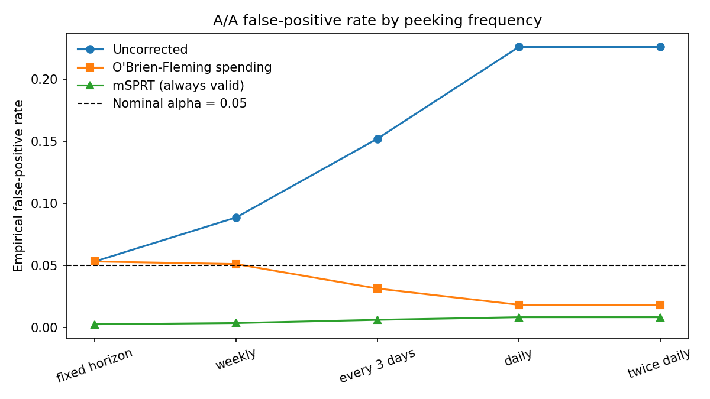

# experiment-failure-modes

Simulation study of when standard A/B test analysis breaks, and by how much.
Ground truth is known by construction in every module, so the error is measured
rather than argued about.

Each module is pre-registered before it runs — hypotheses, parameter grid, and
the conditions under which a deviation is a **bug in my code** rather than a
finding about the method. In a simulation study that distinction is the whole
game, and it is enforced by a test suite rather than by good intentions.

---

## Findings

**Daily peeking at α = 0.05 produced a 22.7% false-positive rate against a
nominal 5%.** Over a 14-day horizon with 14 looks, a rule of "check daily, stop
when significant" rejected a true null in more than one A/A test in five. A
single look at the horizon recovered nominal α (5.3%).

**Uncorrected peeking looks like it buys power, and does not.** Against a true
10% lift, daily peeking "detected" the effect 42.5% of the time versus 24.1%
for a fixed horizon. That 18-point gain is bought with an 18-point increase in
false positives. It is the same rejections, not more true ones.

**CUPED is worth ~0.12% on this dataset, and the reason is coverage, not ρ.**
96.6% of post-period users have no pre-period history at all; among the 3.4%
who do, ρ = 0.19. The literature quotes ρ ≈ 0.7 and roughly half the variance
removed. Even at that ρ, applying CUPED to 3.4% of users would remove 1.7%.
The scope condition matters: this is an anonymous storefront with 1.33 sessions
per user, and a logged-in product with returning users is exactly where the
advertised numbers hold. The point is that a reported ρ without its coverage
denominator overstates the method.

**The standard ICC estimator got the sign wrong on real data, and the
correction is the most useful thing here.** The Fleiss–Cuzick ANOVA estimator
reported ICC = −0.039 for purchase-per-session, implying the naive standard
error is conservative. A size-stratified estimator on the same data gives
**+0.039**. The two disagree by 0.22 on `add_to_cart` (−0.126 vs +0.188) and
flip sign on purchase.

The cause: per-session conversion rate rises nearly 9× with session count
(0.005 at one session to 0.042 at eight). When cluster size correlates with
cluster rate, ANOVA's `msw` is dominated by large high-rate clusters while
`msb` is deflated by small low-rate ones, biasing ICC downward. Simulating the
observed size–rate structure with sessions **independent within user** (true
ICC = 0) returns ANOVA ICC of −0.069 to −0.083 — more negative than the value
actually measured.

It was caught because the simulator could not reproduce −0.039 at any tuning.
For exchangeable binary sessions corr ≥ −p/(1−p) = −0.028 at that rate, so the
measurement sat below its own feasibility floor.

**So the practical recommendation is to skip ICC entirely.** Compute the naive
SE and the delta-method SE on the realized sample and take their ratio. The
design effect is directly observable, needs no correlation estimate, and
conditions on the actual session distribution — which matters, because ρ
demonstrably varies with engagement depth for one of the two metrics
(purchase: +0.032 → +0.047 across n = 2, 3, 4).

**Registered after correction:** `add_to_cart` ρ = +0.188 (flat across strata),
design effect 1.357, naive SE **16.5% too narrow**. `purchase` ρ = +0.039,
design effect 1.074, naive SE **3.6% too narrow**. Both cluster positively; the
contrast is a 4.5× gap in magnitude on the same users.

**Both corrections work, and both are expensive.** O'Brien–Fleming alpha
spending held the false-positive rate at or below nominal under every schedule
(1.8%–4.8%) at a cost of 45% of the power under daily peeking (0.38 → 0.21).
mSPRT always-valid p-values were far more conservative still — never above 1.1%
false positives, but only 13.2% power against the fixed horizon's 37.9%.

**The mSPRT result is dominated by one tuning parameter, and I got it wrong on
the first pass.** The originally registered mixture SD (5% of baseline) gave a
0.0% false-positive rate and 1.2% power — an arm that never fires. Sweeping it
showed power peaks near 20% of baseline and falls off in both directions, while
α control holds everywhere. The amendment is recorded in `CHANGELOG_CONFIG` and
`PREREG_M1_PEEKING.md` rather than folded in silently, because "we retuned
until it worked" and "the method is robust" are different claims.



| Schedule | Looks | Uncorrected | O'Brien–Fleming | mSPRT |
|---|---|---|---|---|
| Fixed horizon | 1 | 0.053 | 0.053 | 0.002 |
| Weekly | 2 | 0.089 | 0.050 | 0.004 |
| Every 3 days | 5 | 0.152 | 0.032 | 0.006 |
| Daily | 14 | 0.227 | 0.018 | 0.009 |

*A/A false-positive rates, nominal α = 0.05, 10,000 simulations per cell,
GA4-calibrated baseline (1.35% session conversion, 3,469 daily users).*

### Calibrated parameters

| Parameter | Placeholder | Measured on GA4 |
|---|---|---|
| Session conversion (all sessions) | 0.0200 | **0.0135** |
| Daily users | 4,000 | **3,469** |
| Sessions per user | 1.60 | **1.33** |
| Count dispersion (var/mean) | 1.20 | **0.75** (underdispersed) |
| CUPED ρ | 0.40 | **0.19** |
| Users with no pre-period | — | **96.6%** |
| ICC, `add_to_cart`/session | 0.10 | **+0.188** (ANOVA said +0.126) |
| ICC, `purchase`/session | — | **+0.039** (ANOVA said −0.039) |

At this traffic a two-week 50/50 test detects a **21.8% relative lift** at 80%
power; four weeks gets to 15.4%. That is the honest answer to "how long should
we run it," and it is a blunt instrument.

---

## Modules

| | Module | Status |
|---|---|---|
| M1 | Peeking and sequential correction | complete |
| M2 | CUPED variance reduction and its break conditions | scaffolded; calibration result registered |
| M3 | Ratio metrics, delta method, user-level bootstrap | scaffolded; two-metric design registered |
| M4 | Interference and switchback designs | not started (optional) |
| M5 | Dilution and triggered analysis as a collider problem | not started (optional) |

M1–M3 are the complete repo. M4 and M5 ship only if M1–M3 are finished first.

---

## Calibration

Simulation parameters that could be invented are instead measured on the
Google Analytics 4 public sample in BigQuery
(`bigquery-public-data.ga4_obfuscated_sample_ecommerce`): baseline session
conversion, daily users, sessions per user and their dispersion, the
intraclass correlation of session conversion, and the pre/post user
correlation that determines whether CUPED is worth anything.

Queries are in `calibration/ga4_params.sql`. `config.py` refuses to run in
calibrated mode against placeholder values, so no figure can be captioned as
calibrated unless it is.

Calibration is complete: `observed_params.json` carries `source: "ga4"` and
949 MB scanned. Every result above is on measured parameters.

Three things the calibration changed that a placeholder would have hidden: it
routed the session-count draw into a branch that exposed an off-by-one in the
simulator (both branches drew with mean `m` and added 1); it produced an ICC
below its feasibility bound, which turned out to be an estimator artifact
rather than behaviour; and it showed the CUPED coverage problem that the ρ
sweep alone would have missed entirely.

Every intermediate ICC estimate is preserved in `observed_params.json` under
`icc_estimator_audit`, including the one that had the sign backwards. A config
assertion prevents its removal.

---

## Layout

```
config.py                  locked spec + CHANGELOG_CONFIG; runners define no grids
PREREG_M1_PEEKING.md       hypotheses, bug criteria, registered limitations
PREREG_M2_CUPED.md
PREREG_M3_RATIO.md
calibration/               GA4 queries -> observed_params.json
sim/dgp.py                 data-generating processes
sim/estimators.py          estimators under test
sim/run_m1.py              M1 runner
tests/                     estimator correctness against known truth
results/, figures/         outputs
```

```bash
pip install -r requirements.txt
pytest -q                  # 28 tests, all estimator-correctness checks
python -m sim.run_m1
```

---

## Limitations

- Simulation, not production data. Effect sizes are chosen, not observed.
- O'Brien–Fleming boundaries are the Lan–DeMets spending-function increments,
  which ignore correlation across looks. That arm is conservative rather than
  exact; the exact recursive boundary needs numerical multivariate-normal
  integration and is out of scope. Registered in advance, not discovered after.
- Twice-daily peeking collapses to daily because the DGP is generated at daily
  granularity. Reported with its true number of distinct looks.
- M3's metrics are low-rate binary conversions, so its results are a *lower
  bound* on how badly the naive standard error fails; a heavy-tailed revenue
  metric would be worse.
- Neither calibrated metric clusters negatively. The negative arm of M3's ICC
  grid is *designed*, not observed, and is labelled as such. Its DGP imposes
  suppression on the count directly, since a Beta mixture can only induce
  non-negative correlation.
- ICC for purchase varies with session depth (+0.032 → +0.047 across n = 2, 3,
  4), so the pooled value is an approximation for that metric.
- The CUPED coverage result is specific to anonymous, acquisition-heavy
  traffic over a holiday window; it is a claim about this user base, not about
  the method.
- The mSPRT power figures depend on a mixture SD with no principled default.
  The sweep is reported rather than a single tuned value.

## Related

- `mortgage-performance-sql` — competing-risks and delinquency analysis on
  Freddie Mac loan-level data
- `ga4-product-analytics` — funnel, cohort, and MDE analysis on the same GA4
  sample used to calibrate this repo
